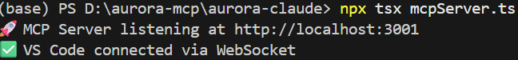
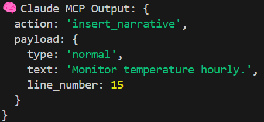

# 🧠 MCP Client with Claude API

Welcome to the MCP Client powered by Claude 3.5 Sonnet! This project demonstrates how to interact with the Claude API using a simple TypeScript setup.

---

## 🚀 Getting Started

### 1. Create a `.env` File

Create a `.env` file in the root directory of your project and add the following environment variables:

```env
CLAUDE_API_KEY=<YOUR-KEY>
CLAUDE_MODEL=claude-3-5-sonnet-20240620
```

---

### 2. Install Dependencies
Install all required packages using one of the following commands:

```
npm install
# or
npm i
```

---


### 3. Start the Server
After successful installation, you can start the server:

```
npx tsx mcpServer.ts
```

---

### 4. Run the Client
After successful installation, you can test the MCP Client by running:

```
npx tsx test.ts
```

And then start the extension to see below result!



---

### ✅ Expected Output
If everything works as expected, you should see an output similar to the image below:

